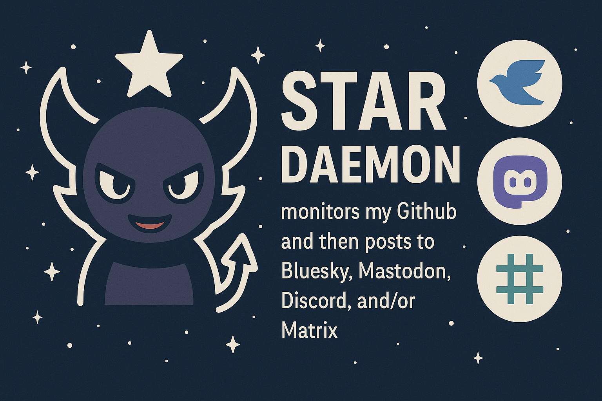

# Star-Daemon 🌟
<div align="center">





**Multi-platform GitHub starring notification daemon**

Star-Daemon monitors your GitHub starred repositories and automatically posts updates to multiple social platforms including Mastodon, BlueSky, Discord, and Matrix.

[](https://www.docker.com/)
[](LICENSE)

</div>

## 🚀 Features

- **Multi-Platform Support**: Post to Mastodon, BlueSky, Discord, and Matrix simultaneously
- **Rich Formatting**: Mastodon posts now include repository metadata (stars, language, description) like BlueSky
- **Dockerized**: Easy deployment with Docker and Docker Compose
- **Secure Configuration**: Multiple secrets management options (Doppler, AWS Secrets Manager, HashiCorp Vault, or .env files)
- **Flexible**: Enable/disable platforms individually
- **Customizable**: Template-based message formatting with repository name
- **Reliable**: Automatic retries and error handling
- **Lightweight**: Minimal resource usage
- **Open Source**: Mozilla Public License 2.0 (MPL-2.0) licensed

> **Note**: Twitter/X support has been removed due to significant API changes and the restrictive pricing model of their free tier. The platform is no longer used by the maintainer.

> We recommend using Mastodon or BlueSky as alternatives with better API support.

## 📋 Requirements

- Python 3.11+
- GitHub Personal Access Token
- At least one platform account (Mastodon, BlueSky, Discord, or Matrix)
- Docker (optional, for containerized deployment)

## 🔧 Installation

### Option 1: Docker (Recommended)

1. **Clone the repository**
   ```bash
   git clone https://github.com/ChiefGyk3D/star-and-toot.git
   cd star-and-toot
   ```

2. **Configure environment**
   ```bash
   cp .env.example .env
   nano .env  # Edit with your credentials
   ```

3. **Build and run with Docker**
   ```bash
   # Build the image
   docker build -f docker/Dockerfile -t star-daemon:latest .
   
   # Run the container
   docker run -d \
     --name star-daemon \
     --env-file .env \
     --restart unless-stopped \
     -v star-daemon-state:/home/stardaemon \
     star-daemon:latest
   ```

4. **View logs**
   ```bash
   docker logs -f star-daemon
   ```

### Option 2: Local Installation

1. **Clone the repository**
   ```bash
   git clone https://github.com/ChiefGyk3D/star-and-toot.git
   cd star-and-toot
   ```

2. **Create virtual environment**
   ```bash
   python3 -m venv venv
   source venv/bin/activate  # On Windows: venv\Scripts\activate
   ```

3. **Install dependencies**
   ```bash
   pip install -r requirements.txt
   ```

4. **Configure environment**
   ```bash
   cp .env.example .env
   nano .env  # Edit with your credentials
   ```

5. **Run the daemon**
   ```bash
   python star-daemon.py
   ```

### Option 3: systemd Service

Use the provided installation script for easy systemd setup:

```bash
sudo scripts/install-systemd.sh
```

Or manually:

1. **Create service file**
   ```bash
   sudo nano /etc/systemd/system/star-daemon.service
   ```

2. **Add configuration**
   ```ini
   [Unit]
   Description=Star-Daemon - GitHub starring notification daemon
   After=network.target

   [Service]
   Type=simple
   User=yourusername
   WorkingDirectory=/path/to/star-and-toot
   Environment="PATH=/path/to/star-and-toot/venv/bin"
   ExecStart=/path/to/star-and-toot/venv/bin/python star-daemon.py
   Restart=always
   RestartSec=10

   [Install]
   WantedBy=multi-user.target
   ```

3. **Enable and start**
   ```bash
   sudo systemctl daemon-reload
   sudo systemctl enable star-daemon
   sudo systemctl start star-daemon
   sudo systemctl status star-daemon
   ```

## ⚙️ Configuration

### Core Settings

| Variable | Required | Default | Description |
|----------|----------|---------|-------------|
| `CHECK_INTERVAL` | No | 60 | Check interval in seconds |
| `LOG_LEVEL` | No | INFO | Logging level (DEBUG, INFO, WARNING, ERROR) |

### GitHub Configuration

| Variable | Required | Description |
|----------|----------|-------------|
| `GITHUB_ACCESS_TOKEN` | **Yes** | GitHub Personal Access Token with `repo` and `user` scopes |
| `GITHUB_USERNAME` | No | Monitor specific user (defaults to authenticated user) |

[How to create a GitHub Personal Access Token](https://docs.github.com/en/authentication/keeping-your-account-and-data-secure/creating-a-personal-access-token)

### Platform Configuration

#### Mastodon

| Variable | Required | Description |
|----------|----------|-------------|
| `MASTODON_ENABLED` | No | Set to `true` to enable |
| `MASTODON_API_BASE_URL` | Yes* | Your Mastodon instance URL (e.g., `https://mastodon.social`) |
| `MASTODON_ACCESS_TOKEN` | Yes* | Mastodon access token |
| `MASTODON_CLIENT_ID` | Yes* | Mastodon client ID |
| `MASTODON_CLIENT_SECRET` | Yes* | Mastodon client secret |

*Required if Mastodon is enabled

**✨ New!** Mastodon posts now include rich formatting like BlueSky:
- Repository star count and programming language
- Repository description (first 200 characters)
- Owner avatar as thumbnail image

#### BlueSky

| Variable | Required | Description |
|----------|----------|-------------|
| `BLUESKY_ENABLED` | No | Set to `true` to enable |
| `BLUESKY_HANDLE` | Yes* | Your BlueSky handle (e.g., `user.bsky.social`) |
| `BLUESKY_APP_PASSWORD` | Yes* | BlueSky app password (not your main password!) |

*Required if BlueSky is enabled

[How to create a BlueSky app password](https://bsky.app/settings/app-passwords)

#### Discord

| Variable | Required | Description |
|----------|----------|-------------|
| `DISCORD_ENABLED` | No | Set to `true` to enable |
| `DISCORD_WEBHOOK_URL` | Yes* | Discord webhook URL |

*Required if Discord is enabled

#### Matrix

| Variable | Required | Description |
|----------|----------|-------------|
| `MATRIX_ENABLED` | No | Set to `true` to enable |
| `MATRIX_HOMESERVER` | Yes* | Matrix homeserver URL (e.g., `https://matrix.org`) |
| `MATRIX_USER_ID` | Yes* | Matrix user ID (e.g., `@user:matrix.org`) |
| `MATRIX_PASSWORD` | Yes** | Matrix password |
| `MATRIX_ACCESS_TOKEN` | Yes** | Matrix access token (alternative to password) |
| `MATRIX_ROOM_ID` | Yes* | Room ID to post to (e.g., `!roomid:matrix.org`) |

*Required if Matrix is enabled  
**Either password or access token required

### Secrets Management (Optional)

For enhanced security, use one of the supported secrets management solutions instead of storing credentials in `.env` files:

#### Option 1: Doppler (Recommended)

[Doppler](https://doppler.com) provides a modern secrets management platform:

1. **Install Doppler CLI**
   ```bash
   curl -sLf https://cli.doppler.com/install.sh | sh
   ```

2. **Login and setup**
   ```bash
   doppler login
   doppler setup
   ```

3. **Configure secrets**
   Use the provided wizard script:
   ```bash
   bash scripts/create-secrets.sh
   ```

4. **Set DOPPLER_TOKEN in .env**
   ```bash
   echo "DOPPLER_TOKEN=your_token_here" >> .env
   ```

5. **Run with Doppler** (optional, token method is automatic)
   ```bash
   doppler run -- python star-daemon.py
   ```

**Docker with Doppler**: Star-Daemon automatically uses Doppler when `DOPPLER_TOKEN` is set in `.env`. Values in Doppler take precedence, falling back to `.env` for any keys not in Doppler.

#### Option 2: AWS Secrets Manager

Use [AWS Secrets Manager](https://aws.amazon.com/secrets-manager/) for cloud-native secrets:

1. **Create secret in AWS**
   ```bash
   aws secretsmanager create-secret \
     --name star-daemon/production \
     --secret-string file://secrets.json
   ```

2. **Configure environment**
   ```bash
   export AWS_SECRET_NAME=star-daemon/production
   export AWS_REGION=us-east-1
   ```

3. **Run with AWS credentials**
   - Use IAM roles (recommended for EC2/ECS)
   - Or set `AWS_ACCESS_KEY_ID` and `AWS_SECRET_ACCESS_KEY`

#### Option 3: HashiCorp Vault

Use [HashiCorp Vault](https://www.vaultproject.io/) for enterprise secrets management:

1. **Store secrets in Vault**
   ```bash
   vault kv put secret/star-daemon \
     GITHUB_ACCESS_TOKEN=ghp_xxx \
     MASTODON_ACCESS_TOKEN=xxx
   ```

2. **Configure environment**
   ```bash
   export VAULT_ADDR=https://vault.example.com:8200
   export VAULT_TOKEN=your_vault_token
   export VAULT_SECRET_PATH=secret/data/star-daemon
   ```

3. **Run normally**
   ```bash
   python star-daemon.py
   ```

**Priority Order**: Doppler → AWS Secrets Manager → HashiCorp Vault → `.env` file

## 📝 Message Customization

Customize notification messages using the `MESSAGE_TEMPLATE` variable:

```bash
MESSAGE_TEMPLATE="I just starred {name} on GitHub: {url}"
```

Available placeholders:
- `{url}` - Repository URL
- `{name}` - Repository full name (owner/repo)
- `{description}` - Repository description

Example templates:
```bash
# Default (includes repo name)
MESSAGE_TEMPLATE="I just starred {name} on GitHub: {url}"

# With description
MESSAGE_TEMPLATE="⭐ Starred {name}: {description}\n{url}"

# Simple
MESSAGE_TEMPLATE="🌟 New star: {url}"
```

## 🏗️ Project Structure

```
star-and-toot/
├── docker/                    # Docker configuration
│   ├── Dockerfile
│   ├── docker-compose.yml
│   └── .dockerignore
├── docs/                      # Documentation
│   ├── CONTRIBUTING.md
│   ├── SECURITY.md
│   ├── MIGRATION.md
│   ├── CHANGELOG.md
│   ├── QUICKSTART.md
│   └── SETUP_CHECKLIST.md
├── scripts/                   # Helper scripts
│   ├── create-secrets.sh      # Secrets setup wizard
│   ├── install-systemd.sh     # systemd service installer
│   ├── uninstall-systemd.sh   # systemd service uninstaller
│   └── setup_matrix_bot.sh    # Matrix bot setup helper
├── .github/workflows/         # CI/CD automation
├── connectors/                # Platform connectors
│   ├── base.py
│   ├── mastodon_connector.py
│   ├── bluesky_connector.py
│   ├── discord_connector.py
│   └── matrix_connector.py
├── star-daemon.py             # Main daemon
├── config.py                  # Configuration management
├── .env.example               # Configuration template
└── requirements.txt           # Python dependencies
```

### Architecture

Star-Daemon uses a modular connector architecture where each platform is independent and can be enabled/disabled via configuration. The `.github/workflows/` folder contains GitHub Actions for automated testing and Docker builds.

## 🔒 Security

- **Secrets Management**: Multiple options - Doppler, AWS Secrets Manager, HashiCorp Vault, or `.env` files
- **Container Security**: Non-root user in Docker
- **Pinned Dependencies**: Locked versions in `requirements.txt`
- **Hash Verification**: Support for `pip install --require-hashes`

### Generating Locked Requirements with Hashes

For maximum security:

```bash
pip install pip-tools
pip-compile --generate-hashes requirements.in -o requirements-lock.txt
pip install -r requirements-lock.txt --require-hashes
```

## 🐛 Troubleshooting

### Common Issues

**Q: "No platforms enabled" error**  
A: Enable at least one platform by setting `*_ENABLED=true` in your `.env` file or Doppler

**Q: GitHub rate limiting**  
A: Increase `CHECK_INTERVAL` to reduce API calls

**Q: Matrix connection fails**  
A: Ensure you're using an app password or access token, not your main password

**Q: Docker container exits immediately**  
A: Check logs with `docker logs star-daemon` - likely a configuration error

**Q: Doppler secrets not loading**  
A: Ensure `DOPPLER_TOKEN` is set in `.env` and has access to the correct project/config

### Debug Mode

Enable debug logging:
```bash
LOG_LEVEL=DEBUG
```

## 📚 Documentation

- [CONTRIBUTING.md](docs/CONTRIBUTING.md) - Contribution guidelines
- [SECURITY.md](docs/SECURITY.md) - Security policy and reporting
- [MIGRATION.md](docs/MIGRATION.md) - Migration guide from v1.x
- [CHANGELOG.md](docs/CHANGELOG.md) - Version history
- [QUICKSTART.md](docs/QUICKSTART.md) - Quick reference guide

## 🤝 Contributing

Contributions are welcome! Please see [docs/CONTRIBUTING.md](docs/CONTRIBUTING.md) for guidelines.

## 📄 License

This project is licensed under the Mozilla Public License Version 2.0 (MPL-2.0) - see the [LICENSE](LICENSE) file for details.

## 🙏 Acknowledgments

- Original project: [star-and-toot](https://github.com/ChiefGyk3D/star-and-toot)
- Inspired by the need for multi-platform social media integration
- Built with love for the open source community

## 📧 Support

- **Issues**: [GitHub Issues](https://github.com/ChiefGyk3D/Star-Daemon/issues)
- **Security**: See [docs/SECURITY.md](docs/SECURITY.md)

---

## 💝 Donations and Tips

If you find Star-Daemon useful, consider supporting development:

**Donate**:

<div align="center">
  <table>
    <tr>
      <td align="center"><a href="https://patreon.com/chiefgyk3d?utm_medium=unknown&utm_source=join_link&utm_campaign=creatorshare_creator&utm_content=copyLink" title="Patreon"></a></td>
      <td align="center"><a href="https://streamelements.com/chiefgyk3d/tip" title="StreamElements"></a></td>
    </tr>
    <tr>
      <td align="center">Patreon</td>
      <td align="center">StreamElements</td>
    </tr>
  </table>
</div>

### Cryptocurrency Tips

<div align="center">
  <table style="border:none;">
    <tr>
      <td align="center" style="padding:8px; min-width:120px;">
        
      </td>
      <td align="left" style="padding:8px;">
        <b>Bitcoin</b><br/>
        <code style="font-size:12px;">bc1qztdzcy2wyavj2tsuandu4p0tcklzttvdnzalla</code>
      </td>
    </tr>
    <tr>
      <td align="center" style="padding:8px; min-width:120px;">
        
      </td>
      <td align="left" style="padding:8px;">
        <b>Monero</b><br/>
        <code style="font-size:12px;">84Y34QubRwQYK2HNviezeH9r6aRcPvgWmKtDkN3EwiuVbp6sNLhm9ffRgs6BA9X1n9jY7wEN16ZEpiEngZbecXseUrW8SeQ</code>
      </td>
    </tr>
    <tr>
      <td align="center" style="padding:8px; min-width:120px;">
        
      </td>
      <td align="left" style="padding:8px;">
        <b>Ethereum</b><br/>
        <code style="font-size:12px;">0x554f18cfB684889c3A60219BDBE7b050C39335ED</code>
      </td>
    </tr>
    <tr>
      <td align="center" style="padding:8px; min-width:120px;">
        
      </td>
      <td align="left" style="padding:8px;">
        <b>Solana</b><br/>
        <code style="font-size:12px;">5T8h3HbyvHgLxwXgchRYbHSqRjZyAr8J7uwjLN9Fh8Jh</code>
      </td>
    </tr>
  </table>
</div>

---

<div align="center">

Made with ❤️ by [ChiefGyk3D](https://github.com/ChiefGyk3D)

## Author & Socials

<table>
  <tr>
    <td align="center"><a href="https://social.chiefgyk3d.com/@chiefgyk3d" title="Mastodon"></a></td>
    <td align="center"><a href="https://bsky.app/profile/chiefgyk3d.com" title="Bluesky"></a></td>
    <td align="center"><a href="http://twitch.tv/chiefgyk3d" title="Twitch"></a></td>
    <td align="center"><a href="https://www.youtube.com/channel/UCvFY4KyqVBuYd7JAl3NRyiQ" title="YouTube"></a></td>
    <td align="center"><a href="https://kick.com/chiefgyk3d" title="Kick"></a></td>
    <td align="center"><a href="https://www.tiktok.com/@chiefgyk3d" title="TikTok"></a></td>
    <td align="center"><a href="https://discord.chiefgyk3d.com" title="Discord"></a></td>
    <td align="center"><a href="https://matrix-invite.chiefgyk3d.com" title="Matrix"></a></td>
  </tr>
  <tr>
    <td align="center">Mastodon</td>
    <td align="center">Bluesky</td>
    <td align="center">Twitch</td>
    <td align="center">YouTube</td>
    <td align="center">Kick</td>
    <td align="center">TikTok</td>
    <td align="center">Discord</td>
    <td align="center">Matrix</td>
  </tr>
</table>

<sub>ChiefGyk3D is the author of Star-Daemon (formerly star-and-toot)</sub>

</div>
